<div align="center">

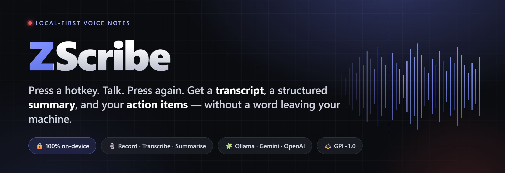

<br/><br/>

<a href="#build-it-yourself"></a> <a href="#the-feature-tour"></a> <a href="#privacy-what-actually-leaves-your-machine"></a>

<br/>

      

</div>

<br/>

<div align="center">
<picture>
  <source media="(prefers-color-scheme: light)" srcset="docs/screenshots/library-summary-light.png">
  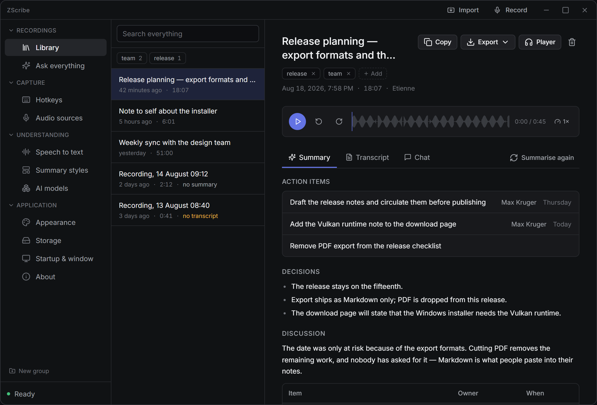
</picture>

<sub>⌜ The library: a meeting turned into decisions, action items, and a clean recap — produced entirely on-device. ⌟</sub>
</div>

---

## Table of contents

- [What ZScribe is](#what-zscribe-is)
- [At a glance](#at-a-glance) · [Project status](#project-status)
- [Why it exists](#why-it-exists)
- [How it works, in four steps](#how-it-works-in-four-steps)
- [The feature tour](#the-feature-tour) — every tab, what it's for, why you'd use it
  - **① Capture** — [Recording bar](#the-recording-bar) · [Hotkeys](#hotkeys) · [Audio sources](#audio-sources)
  - **② From audio to notes** — [Speech to text](#speech-to-text) · [Summary styles](#summary-styles) · [AI models](#ai-models)
  - **③ Your library** — [Library](#library--your-recordings) · [Ask everything](#ask-everything--one-question-across-all-recordings) · [Import](#import--files-and-links)
  - **④ Make it yours** — [Appearance](#appearance) · [Storage](#storage) · [Startup & window](#startup--window) · [About](#about)
- [Privacy: what actually leaves your machine](#privacy-what-actually-leaves-your-machine)
- [Build it yourself](#build-it-yourself)
- [Under the hood](#under-the-hood)
- [Troubleshooting](#troubleshooting)
- [FAQ](#faq)
- [Contributing](#contributing) · [License](#license)

---

## What ZScribe is

ZScribe is a **desktop recorder for conversations, calls, and thinking out loud.** It runs on your own computer and does three things end to end:

1. **Records** — your microphone, your system's audio, or several sources at once.
2. **Transcribes** — locally, with [Whisper](https://github.com/ggerganov/whisper.cpp). Your audio is never uploaded. That isn't a setting you can flip; it's how the app is built.
3. **Summarises** — turns the transcript into a structured document with **decisions, action items, and open questions** — using a local model through [Ollama](https://ollama.com), or a cloud model (Gemini, OpenAI-compatible) only if *you* choose one.

No bot joins your call. No account. No server. No telemetry. The only time ZScribe touches the network at all is to download a Whisper model, and — if you deliberately pick a cloud provider for summaries — to send it the finished *text* (never the audio).

> **In one sentence:** it's what a Plaud Note or Otter would be if it lived entirely on your machine, cost nothing, and answered to no one but you.

---

## At a glance

A quick tour of what's in the box — every one of these is explained in [the feature tour](#the-feature-tour) below.

**Capture**
- One-key global hotkey to start/stop — plus a Record button and a tray menu
- Record your mic, your system's audio (Zoom, a browser, anything playing), or **several sources at once**
- **Name each source** and the transcript automatically says who said what
- A **rewind buffer** that captures the last few minutes *before* you hit record — held in memory, never written to disk
- A floating recording bar with a live waveform, silence/clipping warnings, and an optional **live transcript** as you speak
- Consent-friendly: an optional start tone, a consent line in the transcript, and a tray indicator that can't be switched off

**Understand**
- **On-device transcription** with Whisper — GPU-accelerated (Vulkan/Metal) with automatic CPU fallback, 13 languages
- **Structured summaries** — decisions, action items (task · owner · due), open questions — shaped by editable *Summary styles*
- **Speaker labelling** — by giving each person a mic, or a built-in "tell voices apart" heuristic for single-mic recordings
- **Chat** with any single recording, and **Ask everything** across your whole archive — both answer only from what was actually said, with clickable citations
- Transcribe in the spoken language, summarise in any language you like

**Keep & reuse**
- **Full-text search** across titles, summaries, and transcripts, with highlighted matches
- **Tags**, a **drag-and-drop customisable sidebar**, inline transcript editing, and one-click speaker renaming
- A standalone **player window** that follows the transcript line by line
- Export as **Markdown** or **subtitles (SRT/VTT)**, copy to clipboard, or auto-write every note into an **Obsidian vault** or watched folder
- **Re-summarise or re-transcribe** any recording anytime, with a different style or model

**Yours, and private**
- No account, no server, no telemetry — [what leaves your machine](#privacy-what-actually-leaves-your-machine) is spelled out plainly
- Bring your own model: **Ollama** (local, default), **Google Gemini**, or any **OpenAI-compatible** endpoint
- Optional redaction before any transcript reaches a cloud provider; API keys live in your OS keychain
- Cross-platform, dark/light themes, adjustable window opacity, autostart and tray integration

---

## Project status

ZScribe is at **version 0.1.0** — young, but real and already useful every day. Here's exactly where things stand, because you deserve to know before you install:

| | Status |
|---|---|
| **The core loop** — hotkey → record → Whisper → summary → saved & searchable | Solid, and proven on real hardware |
| **Linux** | Fully tested, end to end |
| **Windows** | Tested too — records, transcribes, summarises, and drives the whole app |
| **macOS** | Built from the same source against **Metal**. This is the one platform still getting its final real-world pass, so treat it as **best-effort** for now |

Everything described in this README is implemented and in the app — this isn't a wishlist. The only asterisk is macOS, where testers are especially welcome. Bug reports on any platform are genuinely valued at this stage.

---

## Why it exists

There are already ways to get a meeting transcribed. Each one asks for something back:

| Option | What it costs you |
|---|---|
| **Hardware recorders** (Plaud Note, etc.) | €150–200, usually a subscription, and every word goes through *their* cloud |
| **Meeting bots** (Otter, Fireflies) | A visible bot sits in your meeting, and the recording lives on someone else's servers |
| **Your phone's voice memos** | No structure, no summary, no search, and you still have to type it up |

For a private conversation, a client call, coaching, therapy notes, journaling, or anything that falls under GDPR, the first two are simply not usable — you cannot send that audio to a third party.

**ZScribe is the third option:** it runs locally, it belongs to you, and it costs nothing. Before it downloads a single model, it looks at your actual machine — CPU, RAM, free disk, and your GPU via Vulkan — and recommends the largest model *this* computer can run at a sensible speed. It never blocks you; it just tells you honestly what to expect.

---

## How it works, in four steps

```
  ┌──────────┐     ┌──────────────┐     ┌───────────────┐     ┌──────────────┐
  │  1. Record│ ──▶ │ 2. Transcribe│ ──▶ │ 3. Summarise  │ ──▶ │ 4. Reuse     │
  │  hotkey / │     │  Whisper,    │     │  your model:  │     │  Markdown,   │
  │  button   │     │  on-device   │     │  local or API │     │  clipboard,  │
  │  mic+audio│     │  no upload   │     │  your choice  │     │  file, notes │
  └──────────┘     └──────────────┘     └───────────────┘     └──────────────┘
```

1. **Record** — press your global hotkey (or the Record button, or the tray menu). A small always-on-top bar shows the time, the live level, and what's being captured.
2. **Transcribe** — when you stop, Whisper runs locally over the audio. Optionally you can see text appear *live* while you record.
3. **Summarise** — the transcript is fed to your chosen model with the instructions of your chosen *Summary style*. Out comes a structured Markdown document plus discrete action items.
4. **Reuse** — copy it, export it as Markdown or subtitles (SRT/VTT), or have every recording written automatically into an Obsidian vault or any folder.

---

## The feature tour

Every screen below is real, and every screenshot is of the actual UI. The tour follows the natural path of a recording — **capture it, turn it into notes, live with it in your library, and make the app yours.**

<br/>

<div align="center">
<h3>① &nbsp; Capture</h3>
<i>Get the sound in — from one keypress, with confidence it's actually working.</i>
</div>

---

### The recording bar

<table>
<tr>
<td width="42%" valign="top">
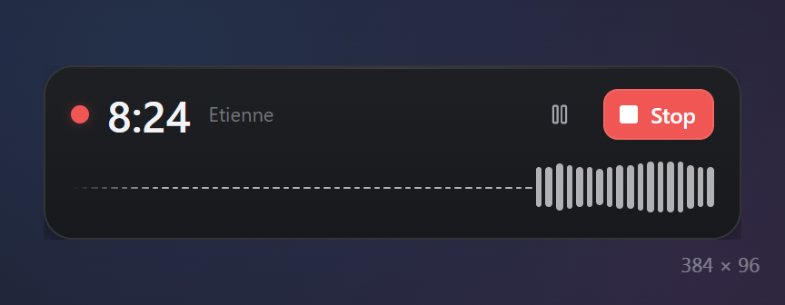
<br/><br/>
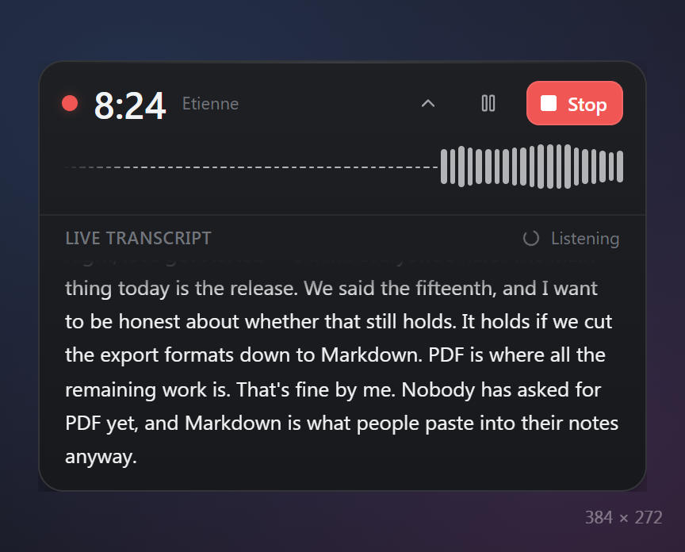
</td>
<td valign="top">

A small, always-on-top window that appears the instant you start. It answers the only questions that matter mid-recording: **is it running, for how long, is sound actually arriving, and from what.**

- The waveform reads from across a room, and a **red dot pulses only while sound is genuinely being captured** — never on a paused recording or a dead microphone, because a light that lies is worse than no light.
- It catches the two failures a waveform hides: **"No sound arriving"** (a muted or unplugged input) and **"Too loud"** (clipping that is wrecking the recording while you read).
- **Pause / Resume** and a big red **Stop** are always one click away — no hunting.
- When you stop, the bar **stays up through transcription** — the moment the machine briefly slows — so the slowdown always has a visible reason instead of feeling like a freeze.

**Live transcript (optional).** Flip on *"Show text while recording"* and the bar grows a panel that shows speech as it happens, rewriting each sentence as more of it arrives (lower screenshot). Perfect for confirming the room is being heard before you stake a real meeting on it. It's honest about the cost, too: without a GPU it runs on your CPU and can make the machine stutter, and the setting says so plainly.

</td>
</tr>
</table>

---

### Hotkeys

<table>
<tr>
<td valign="top">

**One global key starts recording; the same key stops it.** That's the whole promise — capturing a thought costs a single keypress, from any app, without alt-tabbing to ZScribe.

- Type any combination (e.g. `Ctrl+Alt+R`). ZScribe **validates it live** and insists on at least one modifier, so it can never fire while you're typing an email.
- If another app already owns the combination, it **tells you** instead of silently failing — and you can always fall back to the **Record button** in the title bar or the **tray menu**.
- On **Wayland**, your compositor has the final say on the binding, so ZScribe shows you whichever key was *actually* registered rather than pretending.

Because the hotkey only works while ZScribe is running, pair it with *Start with the system* under **Startup & window** and it's always there when a thought is.

</td>
<td width="42%" valign="top">
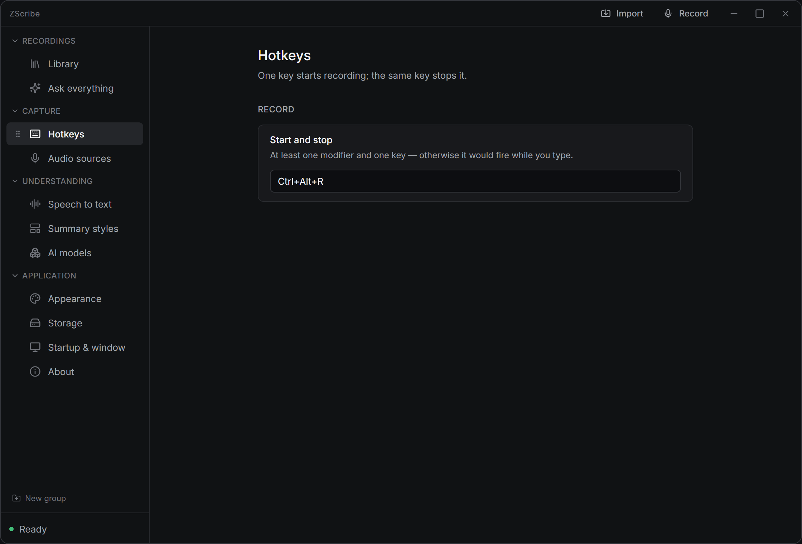
</td>
</tr>
</table>

---

### Audio sources

<table>
<tr>
<td width="42%" valign="top">
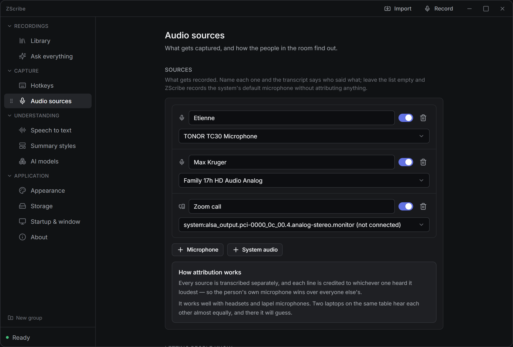
</td>
<td valign="top">

Decide **what gets captured — and how the people in the room find out.** This is where ZScribe is deliberately careful about the two things that make a recorder trustworthy: attribution and consent.

- **One mic, or many.** Record the default microphone with zero setup, or add several sources at once — two microphones and the system's audio, say — and **name each one.** When sources are named, the transcript says *who said what*. Giving each person their own mic is the most reliable speaker separation there is.
- **System audio, both platforms.** Capture whatever is playing — a Zoom call, a browser, a video — via PulseAudio/PipeWire monitors on Linux and WASAPI loopback on Windows.
- **Rewind buffer.** Keep the last 30 seconds to 5 minutes of audio **in memory** (never written to disk, gone when the app closes) so hitting record grabs what was said *before* you remembered to — the one trick a cloud recorder fundamentally can't pull off.
- **Consent, made easy.** Optionally play a tone when recording starts and/or drop a consent line at the top of the transcript. Neither is mandatory, neither is sufficient alone — but both make recording someone by accident much harder.
- **Keep or discard the audio** automatically once the transcript exists.

</td>
</tr>
</table>

<br/>

<div align="center">
<h3>② &nbsp; From audio to notes</h3>
<i>Local transcription, structured summaries, and your choice of model — with no guesswork about your hardware.</i>
</div>

---

### Speech to text

<table>
<tr>
<td valign="top">

Transcription is **[Whisper](https://github.com/ggerganov/whisper.cpp), running on your machine.** Your audio is never uploaded — not as a toggle you trust, but as the way the app is built. This panel is also home to ZScribe's standout trick: a **pre-flight hardware scan.**

- **This machine.** A live readout of your CPU, GPU (and whether it's usable via Vulkan or Metal), free disk, and memory — **measured right now, not guessed.** Installed a driver? Re-scan.
- **Models, ranked for *your* box.** Every Whisper model from Tiny to Large v3 Turbo shows its size *and its real speed on your hardware* ("about 11× real time on your GPU"). The **Recommended** badge is the scan's genuine conclusion — the biggest model this machine runs comfortably — and anything too large for your RAM is flagged, not hidden. Download, switch, and delete models right here.
- **Options that matter:** pin a language or auto-detect (13 supported), toggle GPU use, enable the **live transcript**, switch on **"tell voices apart"** for single-mic recordings, and include **timestamps** in the summary so the model knows *when* things were said.

The scan means you never wait through a download that was never going to run well. It tells you the truth about your hardware up front.

</td>
<td width="42%" valign="top">
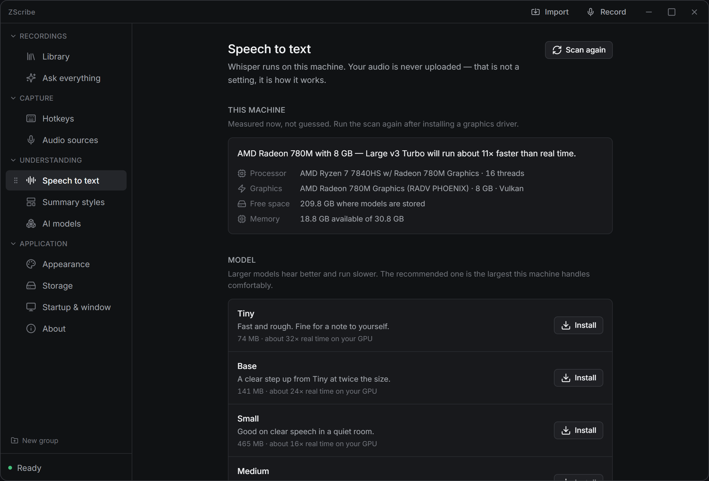
</td>
</tr>
</table>

---

### Summary styles

<table>
<tr>
<td width="42%" valign="top">
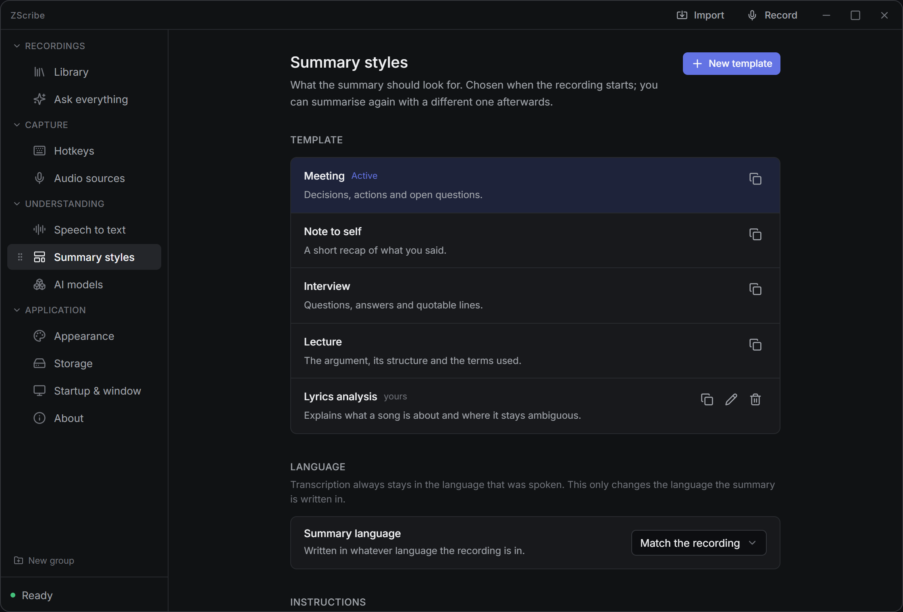
</td>
<td valign="top">

A **style** (template) decides *what the model pulls out* of a recording. The same transcript summarised as a **Meeting** and as a **Note to self** yields two completely different documents — and neither is a bland, generic "summary."

- **Built in and ready:** **Meeting** (decisions, action items, open questions), **Note to self**, **Interview** (Q&A + quotable lines), and **Lecture** (the argument and its structure). These are read-only, so you can't break them.
- **Write your own.** Duplicate one — a working example teaches the shape in a single step — then just describe the sections you want by name, in Markdown. The unglamorous rules (don't invent content, answer in the recording's own language, reply in Markdown) are appended for you automatically, so you only write the interesting part.
- **Summary language.** Transcription always stays in the language actually spoken; this only sets the language the *summary* is written in — *Match the recording*, or force English, German, and a dozen more. Record in German, read your notes in English.

A good style turns "make a summary" into "give me exactly the shape of notes I take for *this* kind of conversation."

</td>
</tr>
</table>

---

### AI models

<table>
<tr>
<td valign="top">

Choose **which model writes your summaries** — and know exactly what that choice means. It affects **summaries only**: the recording and the transcript are produced on your machine either way, so picking a cloud provider sends it the finished *transcript text*, never the audio.

- **Ollama** — *no key, fully local, the default.* Browse and install models in one click. The panel recommends the best fit for your machine and even tells you whether Ollama is running on your GPU. A 7B model writes usable summaries; 12–14B is where they get reliable on long, rambling recordings.
- **Google Gemini** — a free tier that's plenty for everyday use. Paste a key and go.
- **OpenAI-compatible** — OpenAI, OpenRouter, Groq, LM Studio, or anything speaking the same API; just set the endpoint.

**Keys live in your OS keychain** (or an encrypted file if there's no keychain) — never a plaintext config, never handed back to the app window.

**"Before it is sent"** *(cloud only)* is a redaction pass that stays behind when a transcript leaves the machine: strip contact details (emails, phone / card / IBAN numbers), replace speaker names with placeholders, and a **"never send these words"** list for a client, an employer, a project. ZScribe is refreshingly honest that this **is not anonymisation** — patterns are matched reliably, but a name only goes if the app actually knows it. What *you* see is always the untouched original.

</td>
<td width="42%" valign="top">
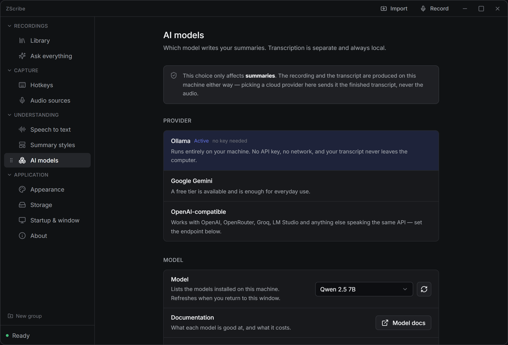
</td>
</tr>
</table>

<br/>

<div align="center">
<h3>③ &nbsp; Your library</h3>
<i>Read, hear, search, question, and import — everything you capture in one place.</i>
</div>

---

### Library — your recordings

The home screen, and where you'll spend most of your time. Every recording lands here, newest first. Open one and it splits into three tabs — **Summary**, **Transcript**, and **Chat**:

<table>
<tr>
<td width="50%" valign="top">
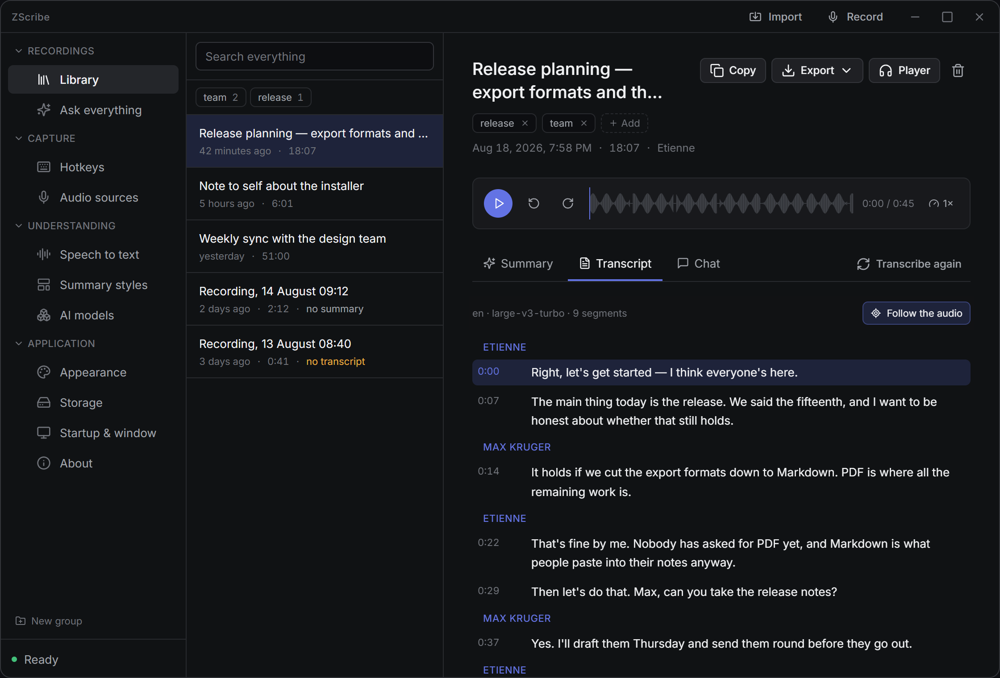
<br/><sub><b>Transcript</b> — speaker-labelled, timestamped, clickable.</sub>
</td>
<td width="50%" valign="top">
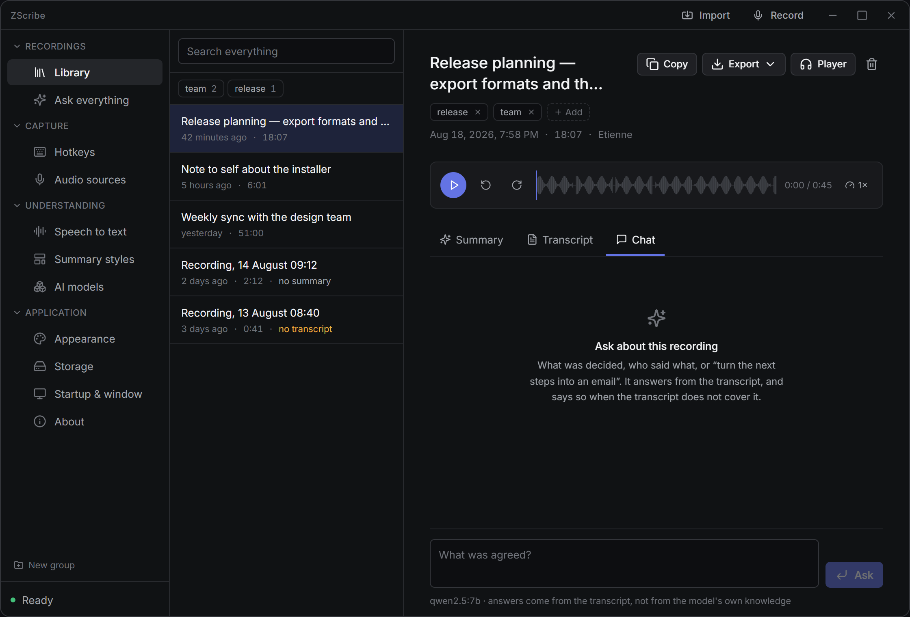
<br/><sub><b>Chat</b> — ask this one recording anything.</sub>
</td>
</tr>
</table>

- **Summary** *(the hero shot at the top of this page)* — action items float to the top as **task · owner · due**, followed by the structured recap your style asked for. A built-in **audio player** sits above the tabs so you can hear any line to check it, and a footer shows the model, tokens, time taken, and how many details were withheld if you redacted.
- **Transcript** — the full text, **labelled by speaker** where voices can be told apart. **Click any line to hear it**, watch *Follow the audio* highlight the line playing now, **fix a mis-heard line** in place, or **rename a speaker everywhere at once**. Correct the text and ZScribe notices the summary is now out of date and offers to rewrite it.
- **Chat** — ask about *this* recording: *"What did we agree?"*, *"turn the next steps into an email."* It answers strictly from the transcript and **admits when the transcript doesn't cover something** instead of inventing an answer. Nothing is saved.

Across the top of every recording: **Search everything** (full-text over titles, summaries, and *everything said*, with the matching passage highlighted), **tags** with one-click filtering, and a **drag-and-drop sidebar** you can reorder, rename, group, and collapse to taste. Per-recording actions — from the button bar or a right-click — cover **Copy as Markdown**, **Export** (Markdown / SRT / VTT), the standalone **Player** window, **Summarise again**, **Transcribe again**, rename, tag, and a delete that truly deletes (audio, transcript, and summary together, no hidden copy, and it asks first).

---

### Ask everything — one question across *all* recordings

<table>
<tr>
<td width="42%" valign="top">
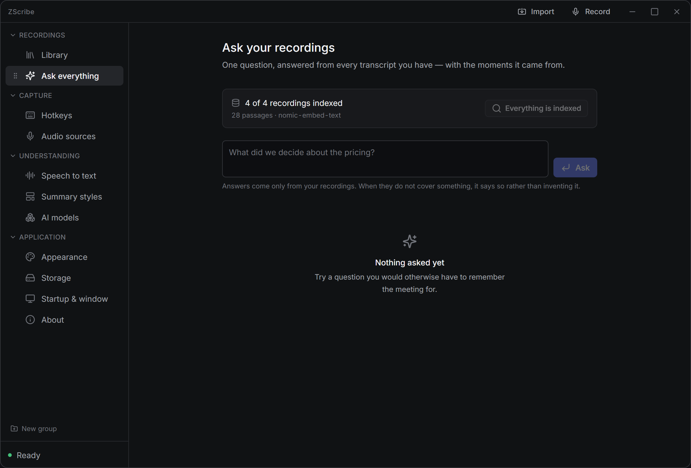
</td>
<td valign="top">

The Chat tab answers about one recording. **Ask everything answers across your entire archive** — *"What did we ever decide about the pricing?"* — which is the question an archive exists to answer.

- It builds a **local semantic index** (vector embeddings, via Ollama) of every transcript. Indexing is a **button you press**, not a silent background chore, because on a big archive it's real minutes of work and heat — so *you* choose the moment.
- Every answer comes back **with the exact moments it drew from.** Click a citation and the **player opens at that second**, so you can verify a claim in one click rather than take the model's word for it.
- As everywhere in ZScribe, it answers only from your recordings — and says so when they simply don't cover what you asked.

It turns a pile of recordings into something you can genuinely interrogate, without remembering which file holds what.

</td>
</tr>
</table>

---

### Import — files and links

<table>
<tr>
<td valign="top">

Not everything gets recorded *in* ZScribe. Import brings in audio or video from anywhere and treats it exactly like something you recorded — same transcript, same summary, same library entry.

- **Files:** WAV, MP3, M4A, MP4, FLAC, OGG, MKV, AIFF. Only the sound is used, so a video is perfectly fine — and you can **drag-and-drop** a file straight onto the window.
- **Links:** paste a URL (e.g. a YouTube talk) and ZScribe pulls just the audio via [`yt-dlp`](https://github.com/yt-dlp/yt-dlp). The dialog **detects your OS** and shows *only* the steps that apply to your machine — how to install yt-dlp, how to keep it current (a stale copy gets a 403 that looks like a broken link), and how to add a JavaScript runtime when a site needs one.
- Imports run **on their own thread**, so the window stays responsive and you can close the dialog while it works.

yt-dlp isn't bundled on purpose — it needs constant updates as sites change, and a frozen copy would rot. Import only what you have the right to: a link being public isn't the same as it being yours to keep.

</td>
<td width="42%" valign="top">
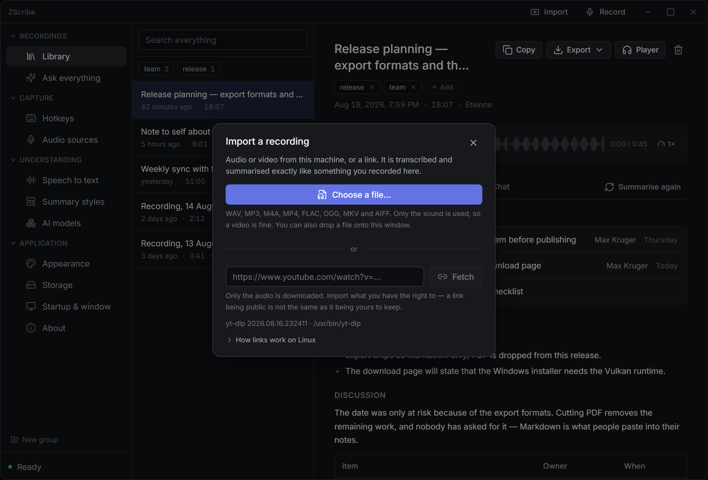
</td>
</tr>
</table>

<br/>

<div align="center">
<h3>④ &nbsp; Make it yours</h3>
<i>Look, storage, and startup behaviour — the settings that make it feel like your app.</i>
</div>

---

### Appearance

<table>
<tr>
<td valign="top">

Small, but it's *your* window all day. **Dark, light, or follow the system** — both themes are fully, deliberately designed, not one theme with the colours flipped. Then two independent **opacity** controls: one for the main window, and a separate one for the **recording bar** — see-through keeps it out of the way of what you're reading, solid makes it easier to read itself. Pick per taste.

</td>
<td width="30%" valign="top" align="center">
<br/><br/>
<b>Dark · Light · System</b><br/><br/>
<sub>two fully-designed themes<br/>+ independent window<br/>and recorder opacity</sub>
</td>
</tr>
</table>

---

### Storage

<table>
<tr>
<td width="42%" valign="top">
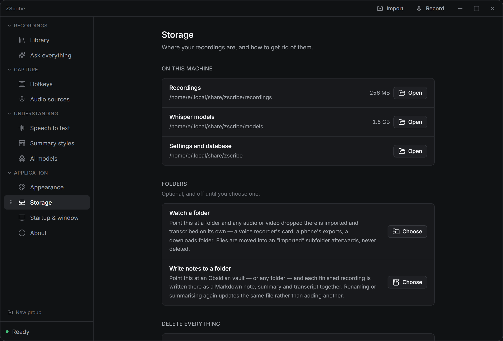
</td>
<td valign="top">

Everything ZScribe keeps, with **visible paths and real sizes** you can open in your file manager: recordings, Whisper models, and the settings/database folder. Nothing is hidden away where you can't find or delete it. And two optional folders join ZScribe to the rest of your machine:

- **Watch a folder.** Point it at a folder and anything dropped there — a voice recorder's SD card, a phone's exports, a downloads folder — is imported and transcribed on its own, then tidied into an *"Imported"* subfolder. Files are moved, never deleted.
- **Write notes to a folder.** Point it at an **Obsidian vault** (or any folder) and every finished recording is written there as a Markdown note, summary and transcript together. Rename or re-summarise and the *same* file updates — no duplicates piling up.
- **Delete everything** removes every transcript, summary, and audio file for real, behind a confirmation. There's no hidden copy to restore from — which is exactly the point of a local tool.

</td>
</tr>
</table>

---

### Startup & window

<table>
<tr>
<td valign="top">

How ZScribe behaves on your computer, so the hotkey is there when you need it and out of the way when you don't:

- **Start with the system** — because the global hotkey only works while ZScribe is running. Set this and it always is.
- **Start minimised** straight to the tray, and **close to the tray** instead of quitting.
- **Notifications** on success (failures are always shown regardless).

Whatever you do to the window, a **recording in progress keeps going** — and the **tray icon says so the entire time.** That one indicator can't be switched off, on purpose: you should never be recording without a visible sign of it.

</td>
<td width="30%" valign="top" align="center">
<br/><br/>
<b>Autostart · Tray</b><br/><br/>
<sub>start with the system<br/>close-to-tray<br/>always-visible<br/>recording indicator</sub>
</td>
</tr>
</table>

---

### About

<table>
<tr>
<td width="42%" valign="top">
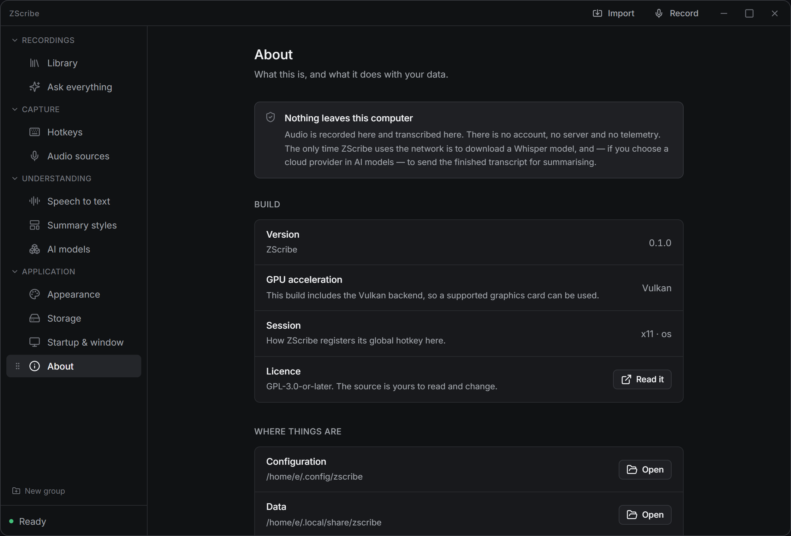
</td>
<td valign="top">

The honest summary of the whole app, in plain language: **nothing leaves this computer** except a model download and — only if you chose one — a transcript to your cloud provider. Below it, the build facts that actually matter: the **version**, which **GPU backend** is compiled in (Vulkan / Metal / CPU-only), and how the global hotkey is registered on your session. And one-click buttons to your **config**, **data**, and **log** folders — the log being the single diagnostic ZScribe keeps, which is exactly what you'll want if you ever file a bug.

</td>
</tr>
</table>

---

## Privacy: what actually leaves your machine

| Data | Where it goes |
|---|---|
| **Your audio** | Stays on your machine. Always. There is no code path that uploads it. |
| **Your transcript** | Stays on your machine — **unless** you choose a cloud provider in *AI models*, in which case the (optionally redacted) *text* is sent there to be summarised. |
| **API keys** | Your OS keychain, or an encrypted local file. Never a plaintext config, never sent to the UI. |
| **Whisper model downloads** | Fetched over the network from the model host. This is the one unavoidable download. |
| **Telemetry / analytics / accounts** | **None. There is no server, and nothing to sign into.** |

If you use **Ollama** for summaries (the default), nothing leaves your machine at all after the initial model downloads.

---

## Build it yourself

Building from source is short. Install once, then run — the command differs slightly by platform:

**Windows**

```powershell
pnpm install
pnpm app:dev        # run the app
pnpm app:build      # produce installers
```

**Linux & macOS**

```bash
pnpm install
pnpm tauri dev      # run the app
pnpm tauri build    # produce packages
```

Both `app:dev` and `tauri dev` go through the same launcher (`scripts/run-tauri.mjs`), which finds your toolchain and picks the right GPU backend — they're interchangeable; the split above is just what each platform tends to use. If something's missing, the launcher tells you **before** it compiles anything and prints the exact command to fix it, rather than stranding you five minutes into a build with a cryptic error.

### Prerequisites

You need **Rust**, **Node**, and **pnpm**. Because whisper.cpp is compiled from source, you also need:

| Tool | What it's for | If it's missing |
|---|---|---|
| **CMake** | builds whisper.cpp | Stops immediately with the install command |
| **LLVM / libclang** | `whisper-rs-sys` generates bindings with bindgen | Stops with the install command. `LIBCLANG_PATH` is found for you |
| **Vulkan SDK** | GPU transcription (**not needed on macOS**) | **Does not stop** — it builds for CPU instead and says so |

**On macOS there is no Vulkan.** whisper.cpp is built against **Metal**, which ships with the OS; the launcher selects `--features metal` automatically. Following "install the Vulkan SDK" on a Mac just installs MoltenVK for nothing.

**Without the Vulkan SDK, `pnpm app:dev` still runs** — transcription just uses the CPU (slower, otherwise identical). To force CPU explicitly:

```bash
pnpm app:dev:cpu
pnpm app:build:cpu
```

And to see what's present and what's missing at any time:

```bash
pnpm check:env
```

<details>
<summary><b>Windows — one-time setup</b></summary>

```powershell
winget install --id OpenJS.NodeJS.LTS
winget install --id Rustlang.Rustup                       # choose the MSVC toolchain
winget install --id LLVM.LLVM                             # libclang, for bindgen
winget install --id Kitware.CMake                         # builds whisper.cpp
winget install --id Microsoft.VisualStudio.2022.BuildTools  # "Desktop development with C++" — MSVC linker
npm install -g pnpm
```

Then **open a new terminal** — every installer writes to `PATH`, and an already-running terminal keeps the old one. This is the single most common reason a build immediately says "cmake not found."

Optional, brings transcription onto the GPU (open another new terminal afterwards):

```powershell
winget install --id KhronosGroup.VulkanSDK
```

Then:

```powershell
pnpm install
pnpm app:dev        # run it
pnpm app:build      # or produce installers
```

Installers land in `src-tauri\target\release\bundle\` (`nsis\…-setup.exe` and `msi\…_en-US.msi`); the bare `.exe` is in `src-tauri\target\release\`.

Notes:
- **You do not need to set `LIBCLANG_PATH`** — the launcher finds `libclang.dll` itself (LLVM, Chocolatey, scoop, msys2, Visual Studio's Clang component, anything on `PATH`).
- Keep the project path free of **spaces and brackets** — a path like `…\zscribe (2)\` confuses CMake. The launcher warns you.
- `vulkan-1.dll` ships with every real graphics driver; a driver-less VM won't have it (use the CPU build there).

</details>

<details>
<summary><b>See the interface in a browser (no Rust build)</b></summary>

Some UI states are almost impossible to reproduce on real hardware — a microphone vanishing mid-recording, a summary failing with no Ollama running, the bar three seconds into transcription. There's a mock Tauri backend for exactly this:

```bash
pnpm dev
# http://localhost:1421/dev.html            — the main window
# http://localhost:1421/dev-recorder.html   — the recording bar
```

The state lives in the URL so it's linkable: `dev-recorder.html?state=recording`, `?state=lost`, `?state=working`, `?state=live`, `dev.html?empty=1`, `dev.html?consent=1`, add `&theme=light` to any of them. In the console, `window.mock` drives the rest (`mock.start()`, `mock.pause()`, `mock.level(0.4)`, `mock.working(37)`, `mock.fail("…")`).

*(The screenshots in this README were captured from exactly this mock.)*

Neither dev page is part of the production build — `vite.config.ts` only ships `index.html`, `recorder.html`, and `player.html`.

</details>

<details>
<summary><b>Useful commands while hacking</b></summary>

```bash
cargo test --workspace                            # also generates the TypeScript bindings
cargo run -p zscribe-platform --example scan      # what the hardware scan sees
cargo run -p zscribe-audio --example record -- 3  # record three seconds
cargo run -p zscribe-audio --example tracks -- 5  # every source at once, one file each
pnpm rs:lint                                       # clippy, warnings as errors
pnpm typecheck                                     # the frontend
```

</details>

---

## Under the hood

**Stack:** [Tauri 2](https://tauri.app) · Rust (edition 2021, 1.85+) · React 19 · TypeScript · pnpm workspaces. Transcription is [whisper.cpp](https://github.com/ggerganov/whisper.cpp) via `whisper-rs`, built against Vulkan (or Metal on macOS) with an automatic CPU fallback.

The Rust side is split into focused crates:

| Crate | Responsibility |
|---|---|
| `zscribe-audio` | Microphone & system-audio capture, resampling, WAV writing, voiceprints |
| `zscribe-stt` | Local Whisper transcription, model download/management, the hardware advisor, speaker splitting |
| `zscribe-core` | Domain logic with no I/O — templates, prompts, diarisation, redaction, subtitles, the archive |
| `zscribe-providers` | Summarisation backends: Ollama, Gemini, OpenAI-compatible |
| `zscribe-store` | Settings, OS-keychain secrets, and the SQLite recording store (with full-text search) |
| `zscribe-platform` | Global hotkeys, session capabilities, and the hardware probe behind the pre-flight scan |

One binary serves every machine: the Vulkan build falls back to CPU when no usable GPU is found, and the hardware scan reports which one is in play.

---

## Troubleshooting

<details>
<summary><b>"cmake not found" right after installing it (Windows)</b></summary>

Open a **new** terminal. Installers update `PATH`, but a terminal that was already open keeps the old value.
</details>

<details>
<summary><b>Transcription is very slow</b></summary>

You're probably on the CPU fallback. Open **Speech to text → This machine** and check whether the GPU shows as usable. On Windows/Linux that needs the Vulkan SDK at build time and the Vulkan loader at runtime; on macOS it uses Metal automatically. A smaller Whisper model is also dramatically faster.
</details>

<details>
<summary><b>Summaries fail / "Ollama isn't reachable"</b></summary>

Install and start [Ollama](https://ollama.com/download), then pull a model (the *AI models* panel installs one in a click). Or switch to a cloud provider in *AI models* and add an API key.
</details>

<details>
<summary><b>A YouTube link fails with a 403</b></summary>

Your `yt-dlp` is likely out of date — YouTube rejects builds that have fallen behind its player. The Import dialog shows the nightly-build command for your OS. It may also need a JavaScript runtime (Deno/Node/QuickJS); the dialog says which and how.
</details>

<details>
<summary><b>The hotkey does nothing</b></summary>

Another app may already hold that combination — the *Hotkeys* panel says so. Pick another, or use the Record button / tray menu. On Wayland the compositor decides the final binding.
</details>

<details>
<summary><b>Something else is wrong</b></summary>

Run `pnpm check:env` to check the toolchain, and grab the log from **About → Logs**.
</details>

---

## FAQ

**Does my audio ever get uploaded?**
No. Recording and transcription both happen on your machine. The only thing that can leave — and only if you choose a cloud provider for summaries — is the finished transcript text.

**Do I need a GPU?**
No. It's much faster with one, but everything works on the CPU.

**Do I need an internet connection?**
Only to download Whisper/Ollama models the first time, and only for cloud summaries if you opt into them. Day to day with Ollama, it's fully offline.

**Is it free?**
Yes, and it's GPL-3.0 — the source is yours to read and change. Cloud providers, if you choose one, bill you directly; the local path costs nothing.

**Which platforms?**
Windows, macOS, and Linux from one codebase. Windows and Linux are tested; macOS is best-effort for now. See [Project status](#project-status).

**Is recording legal?**
Recording people without their knowledge is illegal in many places (a criminal offence in Germany under § 201 StGB, and regulated across the EU and much of the US). ZScribe shows a one-time notice, and offers a start tone and a consent line — but the responsibility is yours. None of this is legal advice.

---

## Contributing

Bug reports and fixes are welcome — **macOS especially** could use real-world testing (see [status](#project-status)). Before opening a PR: `pnpm rs:lint`, `pnpm typecheck`, and `cargo test --workspace` should pass. If a build breaks, run `pnpm check:env` and include its output.

## License

**GPL-3.0-or-later.** See [LICENSE](LICENSE). You are free to use, study, share, and modify ZScribe; derivatives must stay under the same license.

<div align="center">
<br/>
<sub>Built by <b>TheHolyOneZ</b> · Records, transcribes, and summarises — entirely on your own machine.</sub>
</div>
